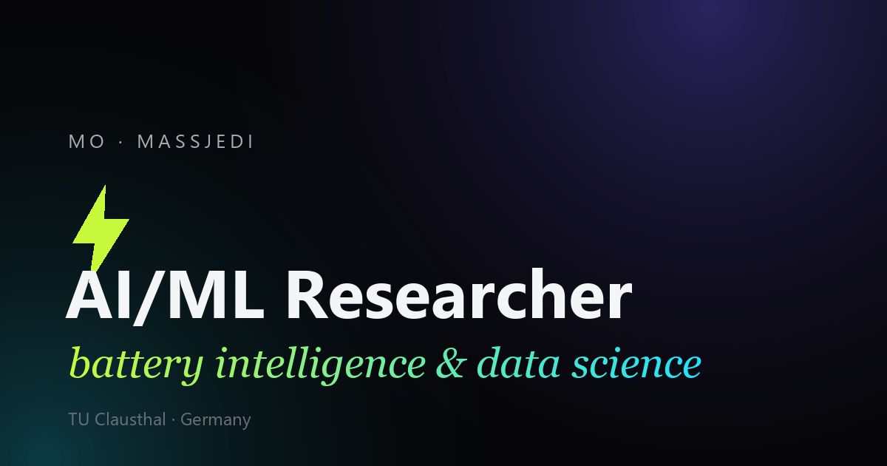

# Mo · MassJedi — Personal Website

> One mind, many lives.

The personal site & portfolio of **Mohammadali (Mo) Masjedi** — AI/ML researcher,
battery-intelligence builder, classical guitarist, and lifelong learner. A dark, cinematic,
motion-rich single-page site in **three languages (EN / FA / DE)** with **no build step** —
it deploys straight to GitHub Pages.

**Live:** https://mohammadalimasjedi-source.github.io/Personal-Portfolio/



---

## ✨ What's inside

- **Trilingual** — English, Persian (فارسی, full right-to-left) and German, switchable in the nav.
- **Cinematic dark theme** with a live, interactive **energy-field canvas**, film grain & glow.
- **Custom cursor** (with contextual labels) + **magnetic** buttons and links.
- **Smooth scrolling** (Lenis) with a graceful fallback to native scroll.
- **Scroll-reveal** animations, **split-text** headlines, animated **count-up** stats.
- **Preloader** with a live counter, full-screen **mobile menu**, scroll progress bar.
- ~20 sections: Hero · Worlds · About · Engineer · Research · Artist · Shiraz Art House ·
  Cinema · Music · Press · Values · Poet · Personal · Channels · Contact — and more.
- **Fully responsive** and respects `prefers-reduced-motion` (accessibility-friendly).
- **Zero dependencies to install** — just static files. One optional CDN script (Lenis).

## 🧱 Tech

Plain **HTML + CSS + vanilla JavaScript**. No Node, no bundler, no framework.
Fonts via Google Fonts (incl. Vazirmatn for Persian); smooth scroll via the Lenis CDN
(optional — the site works without it).

## 📁 Structure

```
Personal-Portfolio/
├── index.html              ← the entire page & all content
├── css/style.css           ← the full design system (incl. RTL styles)
├── js/i18n.js              ← EN/FA/DE translation engine (loads first)
├── js/main.js              ← all interactions / animations
├── js/polish.js            ← in-view nav highlight
├── assets/img/             ← portrait, social card, gallery, world images
├── projects/cellsight/     ← bundled CellSight live demo (synthetic data)
├── docs/STRUCTURE.md       ← short layout note
├── learning/               ← plain-language project explainer
├── handbook/               ← maintenance manual + architecture diagrams
├── .github/workflows/      ← GitHub Pages auto-deploy
└── .nojekyll               ← serve folders as-is on Pages
```

## ▶️ Run it locally

Just open `index.html` in your browser. That's it.

For the full experience (language switch, fonts), serve it with any static server:

```bash
python -m http.server 8000   # then open http://localhost:8000
```

Or use VS Code's "Live Server" extension.

## 🚀 Deploy

Push to `main` → GitHub Actions redeploys to GitHub Pages automatically (about a minute).
Pages source is set to **GitHub Actions**; `.nojekyll` keeps folders served as-is.
See [`PUBLISH.md`](PUBLISH.md) for the simple how-to.

## ✏️ Editing content

- All copy lives in `index.html` (English is the i18n source).
- Every visible string has a `data-i18n` key; its Persian + German translations live in
  `js/i18n.js`. New text needs all three languages.
- After editing `css/style.css` or `js/*.js`, bump the `?v=N` cache-buster in `index.html`.
- Full step-by-step protocols: [`handbook/04-MAINTENANCE-GUIDE.md`](handbook/04-MAINTENANCE-GUIDE.md).

## 🔒 Privacy note

This site was built to be **public-safe** on purpose. It intentionally **excludes** anything
related to private employment/clients, finances, health, and personal documents. Thesis results
are kept high-level (pre-defense). Only public-facing work is featured, and biographical claims
follow an **under-claim rule** — nothing goes on the page without a real source.

## 📜 License

MIT © 2026 Mohammadali Masjedi. Built with intent — dark cinematic edition.
