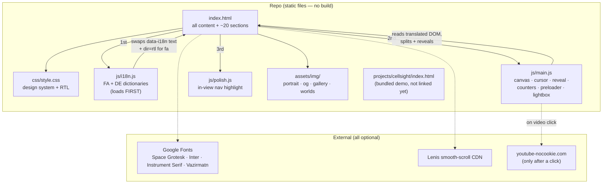
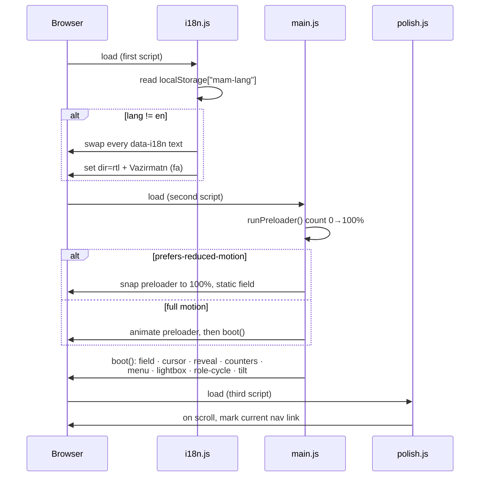
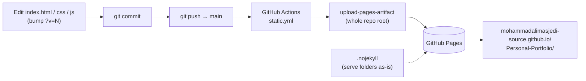

# Architecture diagrams

Real diagrams of the `Personal-Portfolio` repo. Mermaid renders on GitHub and is plain text
(version-controlled + easy to edit).

---

## 1 · Component / load map
How the static files connect and what loads at runtime. Reflects the real `<head>` links and
the script order (`i18n.js` → `main.js` → `polish.js`) in `index.html`.

---

## 2 · Runtime boot sequence
Step-by-step of what happens when the page opens — including the reduced-motion branch.
Mirrors `runPreloader()` → `boot()` and the `prefersReduced` guards in `js/main.js`.

---

## 3 · Deploy flow
From an edit to a live page. Mirrors `.github/workflows/static.yml`.

